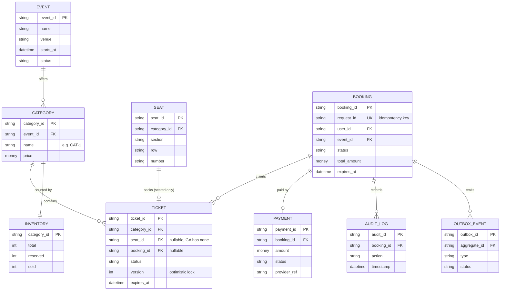
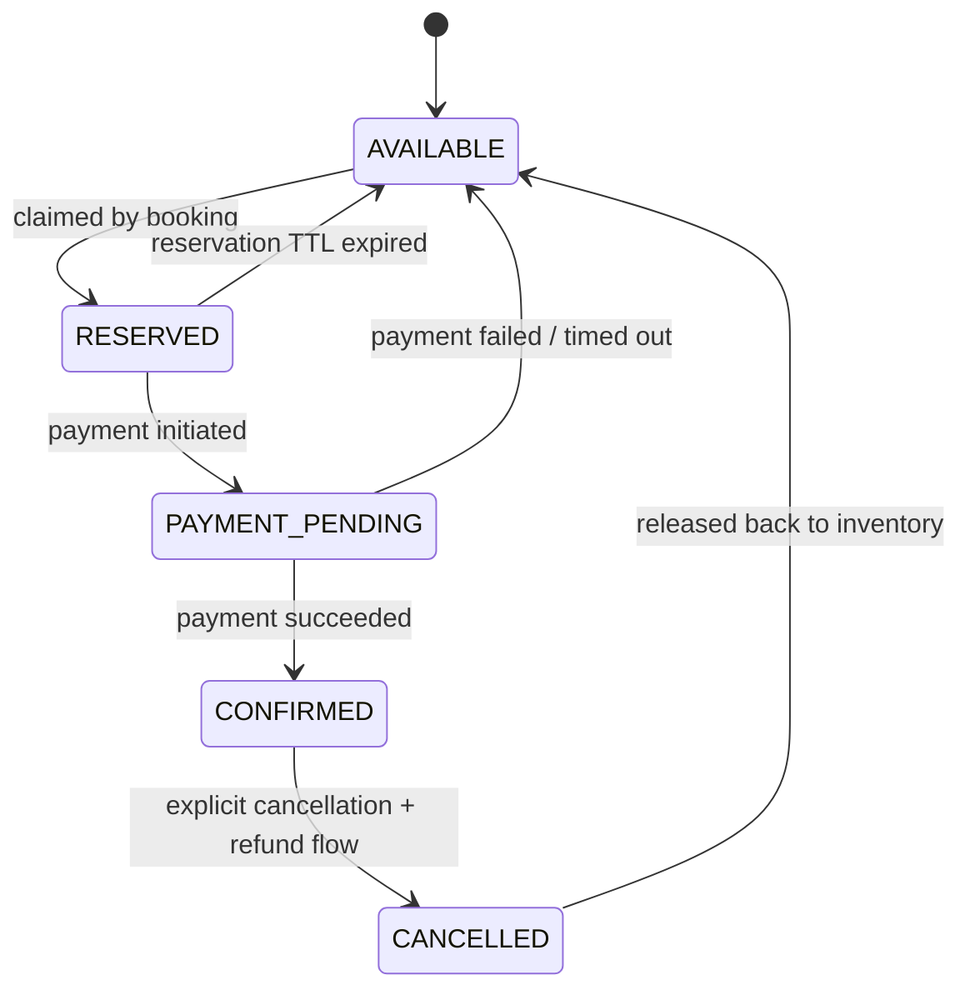
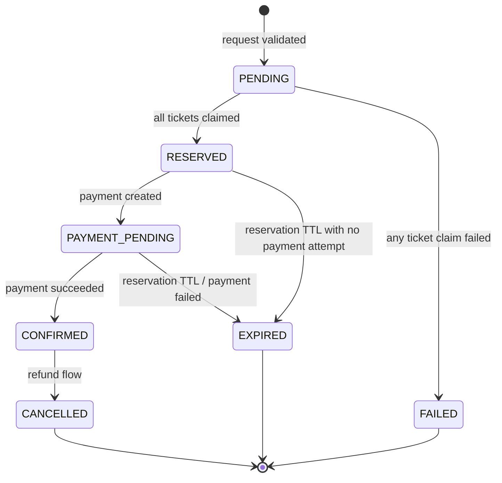
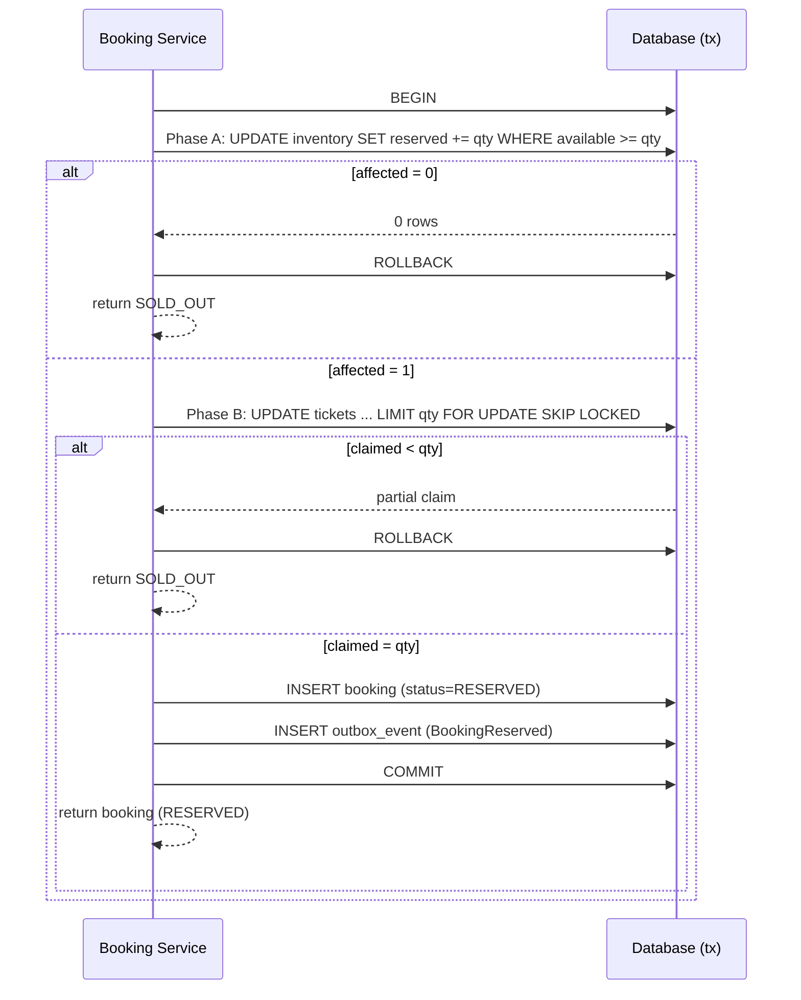
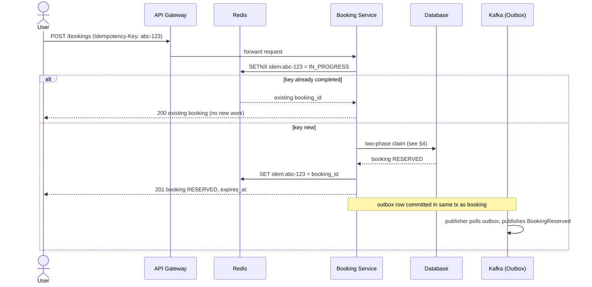
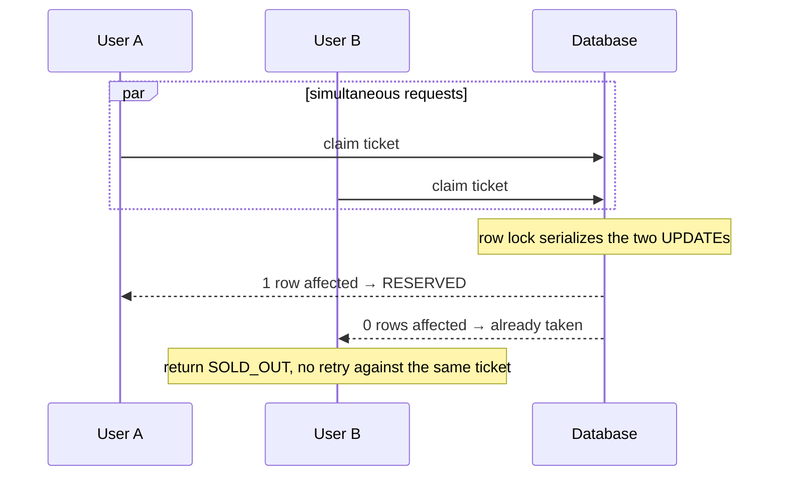
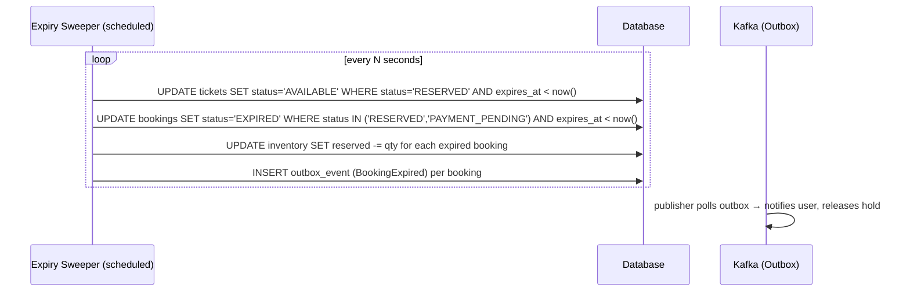
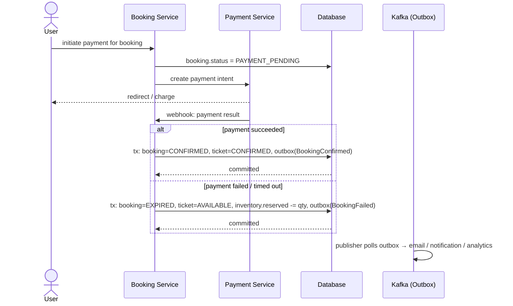
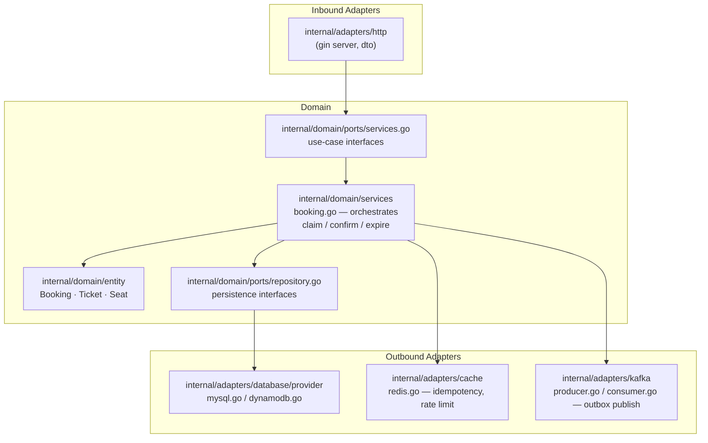

# Ticket Booking — System Design Detail

> Companion to [`flow.md`](./flow.md). That document states *what* must be true
> (the business invariants). This document details *how* the system is shaped
> to satisfy them — domain model, state machines, sequence flows, and the
> mapping onto this repository's hexagonal layout. Documentation and diagrams
> only; no implementation here.

---

## 1. Domain Model

The sellable unit is a **Ticket**. For seated venues a Ticket wraps exactly one
**Seat**; for general-admission categories `seat_id` is null and the Ticket is
drawn from a counted pool. A **Booking** groups one or more Tickets purchased
together under a single idempotent request.



**Why a `version` column on `TICKET`:** it backs optimistic locking as a
belt-and-suspenders check alongside the `WHERE status = 'AVAILABLE'` guard
described in §7 of `flow.md` — the write only lands if both the status and the
version the caller read are still current.

**Why `INVENTORY` is separate from counting `TICKET` rows:** a `COUNT(*) …
WHERE status='AVAILABLE'` under millions of rows and concurrent writers is
itself a contention hazard. `INVENTORY` is a small, single-row-per-category
materialized counter that absorbs the first wave of contention cheaply, before
any individual ticket row is touched. See §4.

---

## 2. Ticket State Machine



Every transition is a single conditional `UPDATE … WHERE status = <expected>`.
An affected-row-count of zero means the caller lost the race and must be
told so — never retried silently into a second sale.

## 3. Booking State Machine

A Booking's status is derived from, but not identical to, its Tickets' state —
a Booking with 3 tickets is `RESERVED` only once *all three* claims succeed;
if any claim fails, the whole booking rolls back (§17 of `flow.md`: "Booked
quantity <= Available quantity" is checked per request, not per ticket).



---

## 4. Reservation Strategy — Two-Phase Atomic Claim

Two independent contention points exist per category, and both must be atomic
on their own, in this order:

**Phase A — Inventory gate (cheap, single row).**
```sql
UPDATE inventory
SET reserved = reserved + :qty
WHERE category_id = :category_id
  AND (total - reserved - sold) >= :qty;
```
Zero affected rows ⇒ reject fast as `SOLD_OUT` without ever touching a ticket
row. This is the row every concurrent request for a hot category contends on
first — see the open question on sharding it in §10.

**Phase B — Ticket claim (specific rows).**
```sql
UPDATE tickets
SET status = 'RESERVED', booking_id = :booking_id, version = version + 1,
    expires_at = :now + :reservation_ttl
WHERE ticket_id IN (
    SELECT ticket_id FROM tickets
    WHERE category_id = :category_id AND status = 'AVAILABLE'
    LIMIT :qty
    FOR UPDATE SKIP LOCKED
);
```
If the claimed row count is less than `:qty` (another transaction raced and
took some rows between the `SELECT` and the lock, or the inventory counter had
drifted), the whole operation rolls back **and** Phase A's reservation is
undone in the same transaction. `SKIP LOCKED` keeps concurrent claimants from
queuing behind each other for rows they were never going to get.



---

## 5. End-to-End Booking Flow (happy path, idempotent)



Redis holds the idempotency key as a fast path; the database is still the
source of truth (per `flow.md` §12) — a durable idempotency record is written
in the same transaction as the booking, and Redis is a cache in front of it,
not a replacement for it.

## 6. Concurrent Race for the Last Ticket



## 7. Reservation Expiry



A sweeper (not a per-booking timer) keeps expiry work batchable and avoids one
scheduled job per in-flight reservation at 5M-ticket scale.

## 8. Payment Confirmation / Failure



The booking transaction never waits on the notification/email/analytics
consumers — it commits against the outbox row and returns; delivery to
downstream services happens asynchronously off that row (`flow.md` §13).

---

## 9. Component Mapping (this repository)

Hexagonal layering already scaffolded in the repo, and where each design
element above lives:



`domain/services/booking.go` is the only place the two-phase claim (§4) and
the state machines (§2, §3) are actually enforced — adapters stay thin
translators in and out of the domain.

---

## 10. API Contract (design-level)

| Method & Path | Purpose | Idempotent via |
|---|---|---|
| `POST /v1/events/{event_id}/bookings` | Reserve tickets | `Idempotency-Key` header → `request_id` |
| `GET /v1/bookings/{booking_id}` | Poll booking status | — (read) |
| `POST /v1/bookings/{booking_id}/payment` | Start payment | Payment provider idempotency key |
| `POST /v1/payments/webhook` | Provider payment callback | Provider event id, deduped |
| `POST /v1/bookings/{booking_id}/cancel` | Cancel a confirmed booking | — (explicit action, not retried) |
| `GET /v1/events/{event_id}/availability` | Read current per-category availability | — (read, cache-fronted) |

Price and availability are always re-read server-side from `CATEGORY` /
`INVENTORY` — a request body never carries a trusted price or ticket status
(`flow.md` §15).

---

## 11. Open Design Questions

These are flagged, not resolved, here:

- **Inventory row contention at 5M-ticket scale.** A single `INVENTORY` row
  per category is still one hot row at sale-opening instant. Options: shard
  the counter (`category_id + shard_no`) and sum on read, or front it with a
  Redis atomic `DECRBY` Lua script reconciled against the DB asynchronously.
  Needs a load-test-driven decision, not an assumed answer.
- **Seat vs. general-admission duality.** `SEAT` is optional on `TICKET`
  today; confirm whether every category is seated for this event or whether a
  GA pool (no `SEAT` rows at all, tickets pre-materialized or virtual) is
  actually required.
- **Distributed lock necessity.** §10–11 of `flow.md` rule out relying on
  `sync.Mutex`; the design above relies on DB row locks alone (no Redis
  Redlock). Confirm this is sufficient before introducing a second
  consistency mechanism to reason about.
- **Outbox publisher delivery semantics.** At-least-once with consumer-side
  dedup is assumed; confirm downstream consumers (notification, analytics)
  are built to be idempotent on `outbox_id`.
